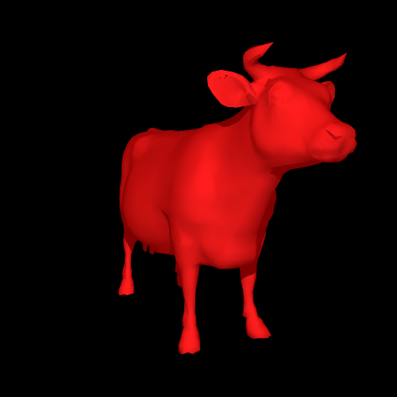
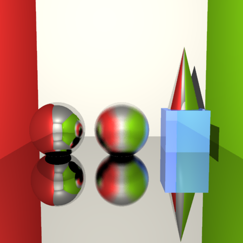
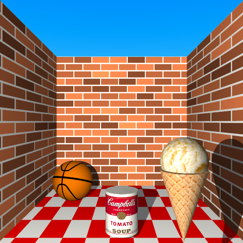

# Raytracer
### Raytracer developed for CS 488 Introduction to Computer Graphics (Winter 2020)
This was originally going to be my submission for the final project, but due to COVID-19 shutdown the project was cancelled.

---

## Features
* Primitives: Cone, Cylinder, Cube, Sphere, Plane
* Triangle meshes (OBJ format), with support for vertex normals and texture coordinates
* Reflection (glossy and non-glossy)
* Refraction (glossy and non-glossy)
* Depth of field
* Texture mapping (planar, spherical, cylindrical, and custom meshes)
* Adaptive supersampling
* Animation (via Lua scripting and ffmpeg)
* Mesh rendering acceleration
    * Rectangular bounding volumes
    * 3D grid-based acceleration
* Multithreaded rendering

## Build instructions
We use **premake4** as our cross-platform build system. First you will need to build all
the static libraries that the ray tracer depend on. To build the libraries, open up a
terminal, and **cd** to the top level of the project directory (`raytracer`) and then run the
following:
```sh
/raytracer$ premake4 gmake
/raytracer$ make
```
Next we can build the actual raytracing program:
```sh
/raytracer$ cd src/
/raytracer/src$ premake4 gmake
/raytracer/src$ make
```

## Usage
Invoking the raytracer is simple. Simply execute the `raytrace` binary, passing it the path to the Lua scene file:
```sh
/raytracer/src$ ./raytrace path/to/scene.lua
```

## Assets
The [`src/Assets`](src/Assets) directory contains some scene definitions, meshes, and textures used to produce the sample renders below. Some of the scenes were from the original CS 488 skeleton code.

## Sample renders
Some sample renders can be found in [`src/out/`](src/out/) and [`src/showcase/`](src/showcase/).

|   |  |  |
|:---:|:---:|:---:|
|Primitives|Mesh (flat shading)|Mesh (Phong shading)|

|  |  |  |
|:---:|:---:|:---:|
|Regular and glossy reflection|Regular refraction|Glossy refraction|

|  |  |  |
|:---:|:---:|:---:|
|Depth of field|Texture mapping (primitives)|Texture mapping (meshes)|
